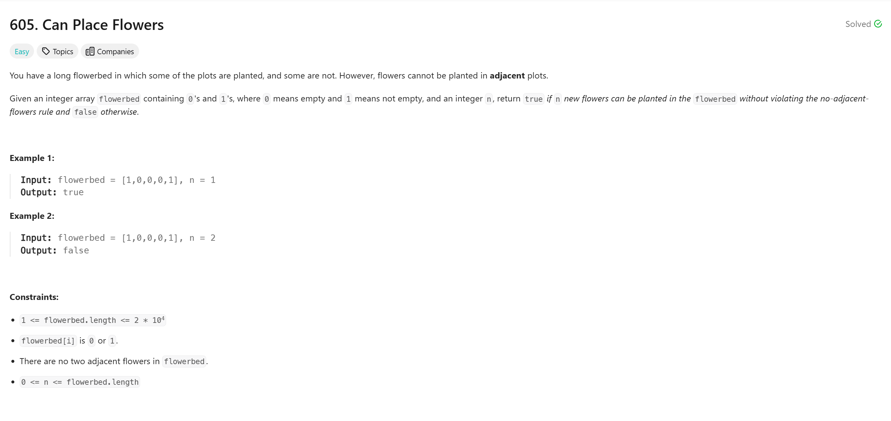

# Can Place Flowers 

## Approach
The problem involves determining whether `n` new flowers can be planted in a flowerbed without violating the rule that no two flowers can be adjacent. Here's how the approach works:

1. **Padding the Flowerbed:**  
   - To simplify edge cases (such as the first and last positions), create a new vector `v` with two extra spaces, one at the beginning and one at the end, initialized to `0`.
   - Copy the contents of the input `flowerbed` to the middle of this new vector.

2. **Iterate Through the Flowerbed:**  
   - Loop through the padded flowerbed from index `1` to `m` (length of the original flowerbed).
   - For each position, check if the current position (`v[i]`) and its neighbors (`v[i-1]` and `v[i+1]`) are all `0`.
     - If true, plant a flower by setting `v[i] = 1` and increment the count `ans` of planted flowers.

3. **Check if Enough Flowers Are Planted:**  
   - After the loop, compare the count `ans` with `n`.  
   - If `ans >= n`, return `true` (it's possible to plant the required flowers). Otherwise, return `false`.

This approach ensures that flowers are only planted in valid positions, adhering to the problem's constraints.

---

## Complexity
### Time Complexity
- **O(m):**  
  - Iterating through the flowerbed takes linear time, where `m` is the size of the input `flowerbed`.

### Space Complexity
- **O(m):**  
  - The additional vector `v` with padding requires extra space proportional to the size of the input `flowerbed`.

---

## Constraints
- `1 <= flowerbed.length <= 2 * 10^4`
- `flowerbed[i]` is `0` or `1`.
- There are no two adjacent flowers in `flowerbed`.
- `0 <= n <= flowerbed.length`.
