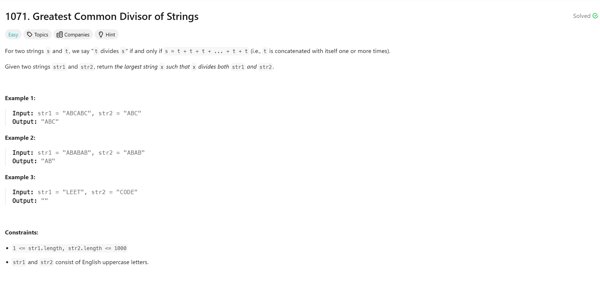

# Greatest Common Divisor of Strings 

## Approach
The problem involves finding the greatest common divisor (GCD) of two strings based on their repeating patterns. Here's how the approach works:

1. **Check Compatibility:** 
   - If `str1 + str2` is not equal to `str2 + str1`, the two strings are incompatible and do not share a common pattern. In such cases, return an empty string `""`.

2. **Calculate the GCD of Lengths:** 
   - Compute the GCD of the lengths of the two strings (`n` and `m`) using the built-in `__gcd` function.

3. **Extract the GCD String:** 
   - The GCD string is the prefix of `str1` with a length equal to the computed GCD. Return this substring as the result.

This approach ensures that the result is the largest string that can repeatedly construct both `str1` and `str2`.

---

## Complexity
### Time Complexity
- **O(n + m):** 
  - Concatenating and comparing `str1 + str2` and `str2 + str1` takes O(n + m).
  - Computing the GCD of two integers takes O(log(min(n, m))).
  - Extracting the substring is O(k), where `k` is the length of the GCD.

### Space Complexity
- **O(n + m):** Temporary storage for concatenation and the result string.

---

## Constraints
- `1 <= str1.length, str2.length <= 1000`
- `str1` and `str2` consist of uppercase English letters.
