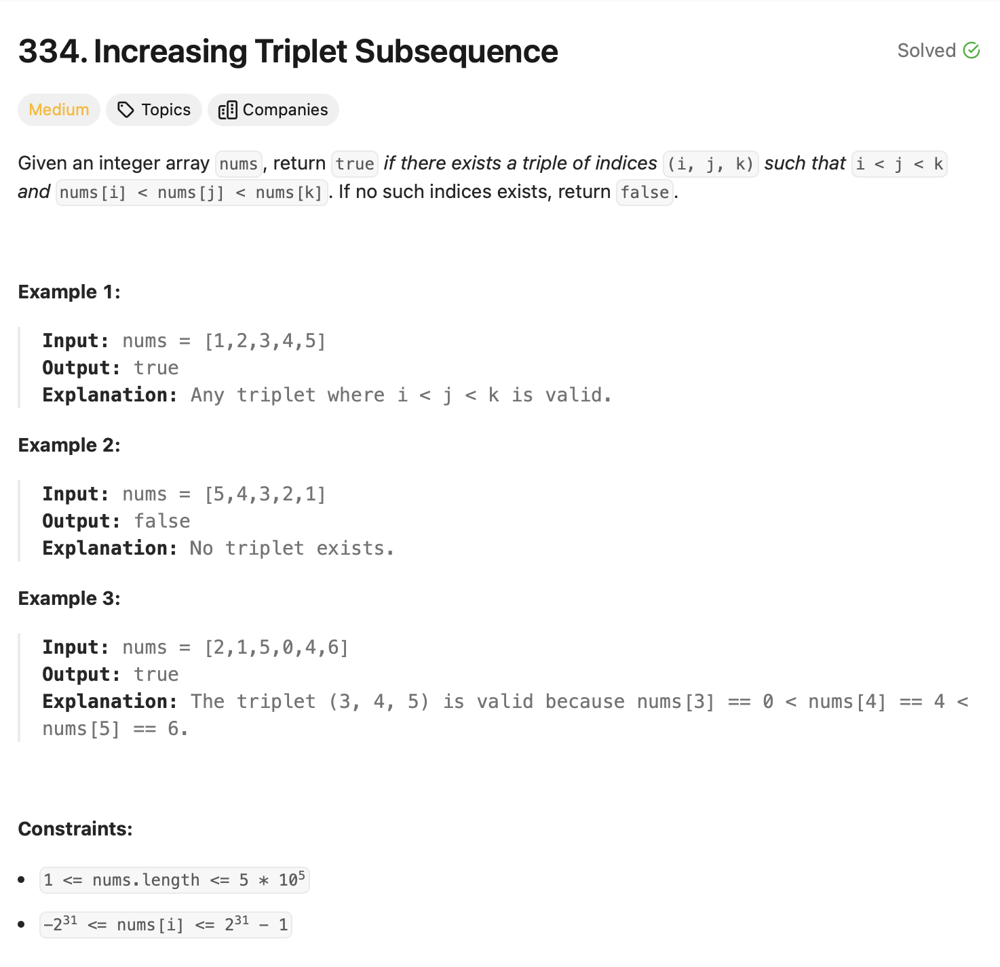

# Increasing Triplet Subsequence 

## Approach
The problem involves determining if there exists a strictly increasing subsequence of three numbers in the given array. Here's how the approach works:

1. **Initialize Variables:** 
   - Use two variables `p1` and `p2` to track the smallest and second smallest values seen so far, respectively. Initialize both to `INT_MAX`.

2. **Iterate Through the Array:** 
   - For each element in the array:
     - If the current element is smaller than or equal to `p1`, update `p1` to the current element.
     - Else, if the current element is smaller than or equal to `p2`, update `p2` to the current element.
     - Otherwise, if the current element is larger than both `p1` and `p2`, it means a valid increasing triplet subsequence exists, and we return `true`.

3. **Return Result:** 
   - If the loop completes without finding such a triplet, return `false`.

This approach efficiently tracks the smallest and second smallest values while scanning through the array, ensuring that a valid triplet is identified if it exists.

---

## Complexity
### Time Complexity
- **O(n):** 
  - The array is traversed once.

### Space Complexity
- **O(1):** 
  - Only two variables, `p1` and `p2`, are used for tracking, requiring constant space.

---

## Constraints
- `1 <= nums.length <= 5 * 10⁵`
- `-2³¹ <= nums[i] <= 2³¹ - 1`
