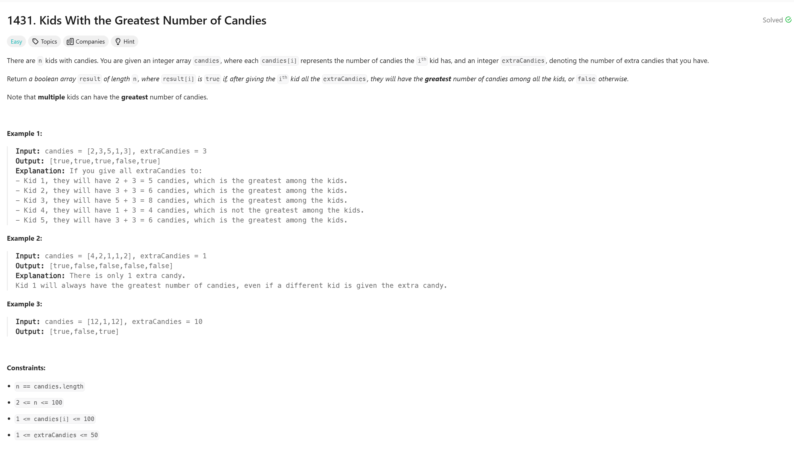

# Kids With the Greatest Number of Candies 

## Approach
The problem involves determining whether each child has the greatest number of candies if given extra candies. Here's how the approach works:

1. **Find the Maximum Candies:** 
   - Iterate through the `candies` array to find the maximum number of candies any child currently has (`m`).

2. **Evaluate Each Child:** 
   - Create a result vector `v` to store boolean values.
   - For each child, add `extraCandies` to their current candy count and compare it with `m`.
   - If the sum is greater than or equal to `m`, append `true` to the result vector; otherwise, append `false`.

3. **Return the Result Vector:** 
   - The final result vector contains `true` or `false` for each child based on whether they can have the greatest number of candies.

This approach ensures that each child's potential maximum is compared efficiently with the overall maximum.

---

## Complexity
### Time Complexity
- **O(n):**
  - Finding the maximum in the `candies` array takes O(n).
  - Evaluating each child also takes O(n).
  - Overall, the complexity is linear with respect to the number of children.

### Space Complexity
- **O(n):**
  - The result vector `v` requires space proportional to the size of the input array.

---

## Constraints
- `n == candies.length`
- `2 <= n <= 100`
- `1 <= candies[i] <= 100`
- `1 <= extraCandies <= 50`
