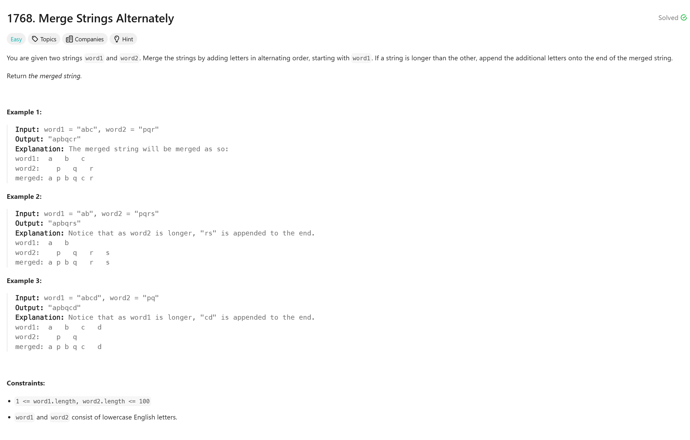

# Merge Strings Alternately 

## Approach
The problem involves merging two strings alternately character by character. Here's how the approach works:
1. Use two pointers `l1` and `l2` to track the current position in `word1` and `word2`, respectively.
2. Use a loop to continue until both pointers reach the end of their respective strings.
   - If one string is exhausted (pointer reaches the length of the string), append the remaining characters of the other string to the result.
   - Otherwise, append one character from `word1` and one from `word2` alternately to the result string `ans`.
3. Return the final merged string.

This approach ensures that the strings are merged in an alternating fashion, with any leftover characters from the longer string added at the end.

---

## Complexity
### Time Complexity
- **O(n + m):** We iterate through both strings once, where `n` is the length of `word1` and `m` is the length of `word2`.

### Space Complexity
- **O(n + m):** The result string `ans` takes space proportional to the combined length of `word1` and `word2`.

---

## Constraints
- `1 <= word1.length, word2.length <= 100`
- Both `word1` and `word2` consist of lowercase English letters.