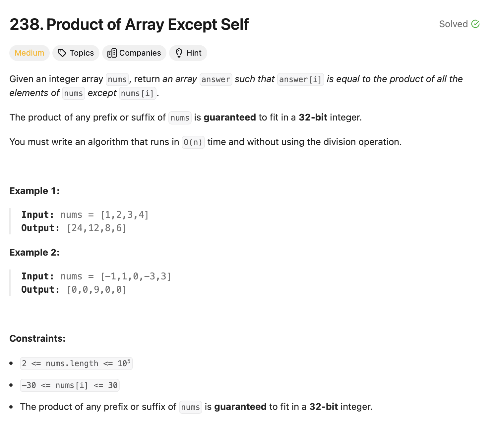

# Product of Array Except Self 

## Approach
The problem involves calculating the product of all elements in an array except the current element, without using division. Here's how the approach works:

1. **Use Two Auxiliary Arrays:** 
   - Create two arrays `v1` and `v2` of size `n` to store the prefix and suffix products, respectively.
   - Initialize both arrays with `1`.

2. **Compute Prefix Products:**
   - Iterate through the array from left to right. For each element at index `i`, compute the product of all elements to the left of it and store it in `v1[i]`.

3. **Compute Suffix Products:**
   - Iterate through the array from right to left. For each element at index `i`, compute the product of all elements to the right of it and store it in `v2[i]`.

4. **Calculate the Result:**
   - Multiply the prefix product from `v1[i]` and the suffix product from `v2[i]` for each index `i` and store the result in the final array `ans`.

5. **Return the Result:**
   - Return the array `ans`, which contains the product of all elements except the one at the current index.

This approach ensures that no division is used, and all calculations are performed using multiplication and prefix/suffix products.

---

## Complexity
### Time Complexity
- **O(n):** 
  - Computing the prefix products takes O(n).
  - Computing the suffix products takes O(n).
  - Combining the prefix and suffix products takes O(n).

### Space Complexity
- **O(n):**
  - The additional space is used for the arrays `v1` and `v2`.

---

## Constraints
- `2 <= nums.length <= 10^5`
- `-30 <= nums[i] <= 30`
- The product of any prefix or suffix of `nums` is guaranteed to fit in a 32-bit integer.
