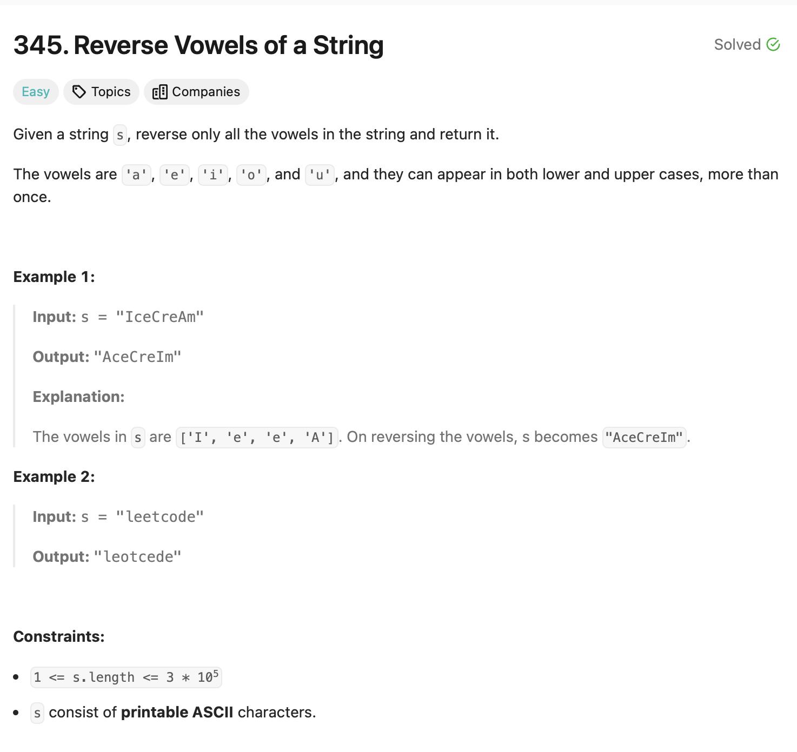

# Reverse Vowels of a String 

## Approach
The problem involves reversing only the vowels in a given string while keeping all other characters in their original positions. Here's how the approach works:

1. **Identify Vowels:**
   - Use a set `s1` to store all the vowels (both lowercase and uppercase) for quick lookup.

2. **Extract Vowels:**
   - Traverse the string and collect all the vowels in a separate string `s2`.

3. **Reverse Vowels:**
   - Start from the end of `s2` and replace the vowels in the original string with the vowels in reverse order.

4. **Build the Result:**
   - Iterate through the original string. For each character:
     - If it's a vowel, replace it with the corresponding vowel from `s2` in reverse order.
     - Otherwise, add the character to the result string as-is.

5. **Return the Result:**
   - The final string with reversed vowels is returned.

---

## Complexity
### Time Complexity
- **O(n):** 
  - Traversing the string to extract vowels takes O(n).
  - Traversing again to build the result string also takes O(n).
- Overall, it is linear in terms of the input string size `n`.

### Space Complexity
- **O(v):** 
  - Where `v` is the number of vowels in the string, used for storing the vowels in `s2`.

---

## Constraints
- `1 <= s.length <= 3 * 10^5`
- `s` consists of printable ASCII characters.
