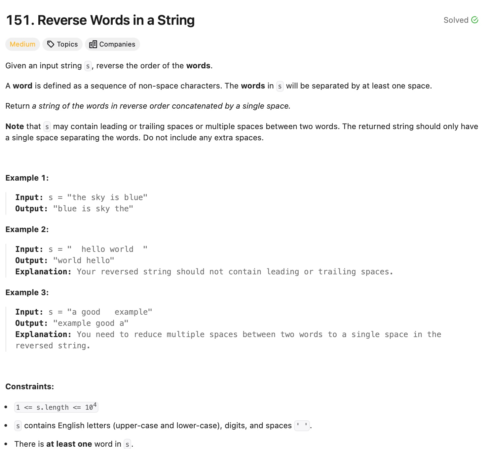

# Reverse Words in a String 

## Approach
The problem requires reversing the order of words in a string while removing any leading, trailing, or extra spaces between words. Here's how the approach works:

1. **Trim Leading and Trailing Spaces**:
   - Use two pointers, `l1` and `l2`, to locate the first and last non-space characters in the string. This ensures that leading and trailing spaces are ignored.

2. **Split Words**:
   - Traverse the string between `l1` and `l2` to extract individual words.
   - When encountering a space, push the current word (stored in `temp`) to a vector and reset `temp` to an empty string.
   - Push the last word into the vector when the traversal ends.

3. **Reverse Words**:
   - Iterate through the vector of words from the last word to the first.
   - Append each word to the result string `ans`, adding a space between words, except for the last word.

4. **Return the Result**:
   - The final string contains the words in reverse order, separated by single spaces.

---

## Complexity
### Time Complexity
- **O(n):** 
  - Traversing the string to remove extra spaces and extract words takes O(n), where `n` is the length of the string.
  - Reversing the words and constructing the result string takes O(n).

### Space Complexity
- **O(n):** 
  - Temporary storage for the vector of words and the result string.

---

## Constraints
- `1 <= s.length <= 10⁴`
- `s` contains only English letters (both uppercase and lowercase), digits, and spaces.
- There is at least one word in `s`.
