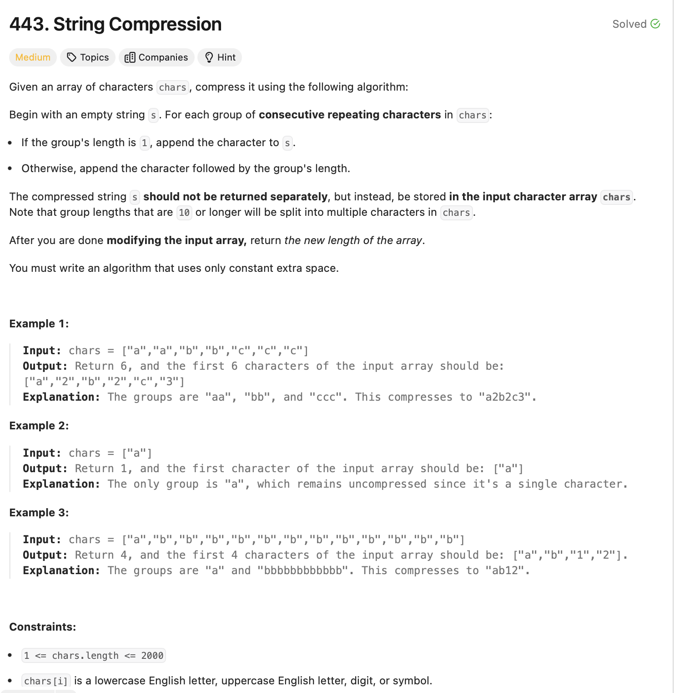

# String Compression 

## Approach
The problem involves compressing a string by replacing consecutive repeating characters with the character followed by its count. Here's how the approach works:

1. **Initialize Variables:**
   - Use a string `ans` to store the compressed version of the string.
   - Use a string `s` to track the current character being processed.
   - Use a counter `cnt` to count occurrences of the current character.

2. **Iterate Through the Input:**
   - Traverse the array `chars` and:
     - If `s` is empty or the current character is different from the previous one:
       - Append the current character and its count (if greater than 1) to `ans`.
       - Reset `s` and `cnt` to track the new character.
     - Otherwise, increment the count of the current character.

3. **Finalize the Compression:**
   - After the loop, append the last character and its count (if greater than 1) to `ans`.

4. **Update the Input Array:**
   - Resize the `chars` array to match the size of the compressed string.
   - Copy the characters from `ans` into `chars`.

5. **Return the Result:**
   - Return the length of the compressed string.

This approach ensures that the input array `chars` is updated in place with the compressed version of the string.

---

## Complexity
### Time Complexity
- **O(n):** 
  - Traversing the array takes O(n), where `n` is the size of `chars`.
  - Appending characters to the result string and resizing the array are linear operations.

### Space Complexity
- **O(1):** 
  - The compression is performed in place, with no additional space proportional to the size of the input.

---

## Constraints
- `1 <= chars.length <= 2000`
- `chars[i]` is a lowercase English letter, uppercase English letter, digit, or symbol.
