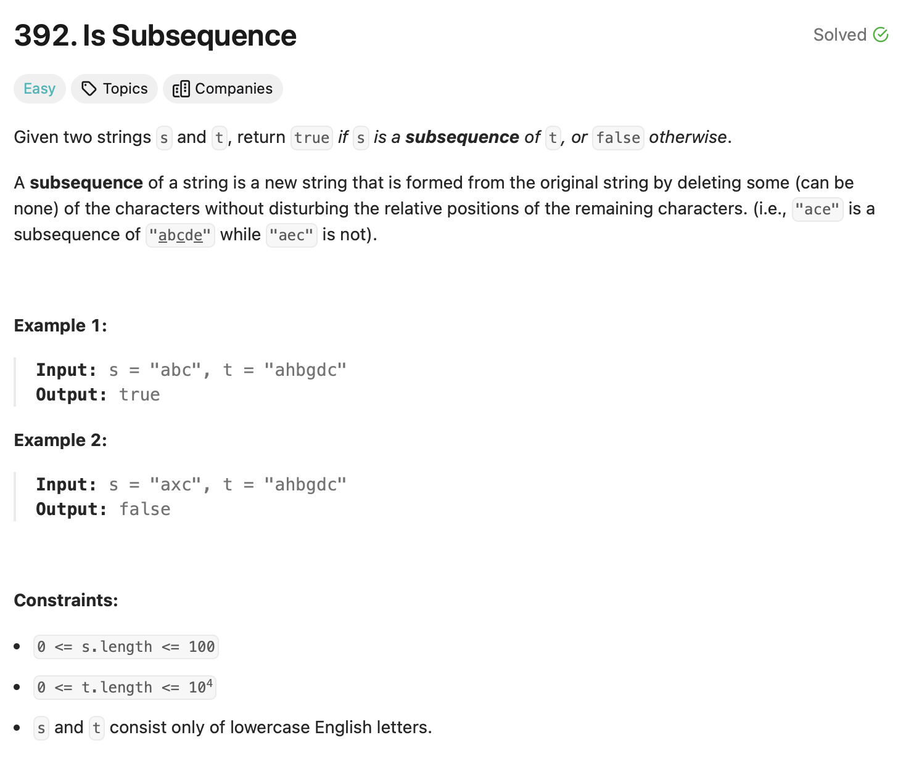

# Is Subsequence 

## Approach
The problem requires checking if a string `s` is a subsequence of another string `t`. A subsequence is formed by deleting some or no characters from `t` without changing the order of the remaining characters. Here's how the approach works:

1. **Initialize Pointers:**
   - Use two pointers:
     - `l1` points to the current character in `s`.
     - `l2` points to the current character in `t`.

2. **Traverse the String `t`:**
   - Iterate through `t` using the `l2` pointer:
     - If the character `s[l1]` matches `t[l2]`, increment both `l1` and `l2`.
     - Otherwise, increment only `l2`.

3. **Check Completion:**
   - If `l1` reaches the length of `s` (`n`), it means all characters in `s` have been matched in `t` in the correct order. Return `true`.
   - If the iteration completes and `l1` is not equal to `n`, return `false`.

---

## Complexity
### Time Complexity
- **O(m):**
  - The string `t` is traversed once, where `m` is the length of `t`.

### Space Complexity
- **O(1):**
  - No additional space is used beyond the two pointers.

---

## Constraints
- `0 <= s.length <= 100`
- `0 <= t.length <= 10^4`
- `s` and `t` consist only of lowercase English letters.
