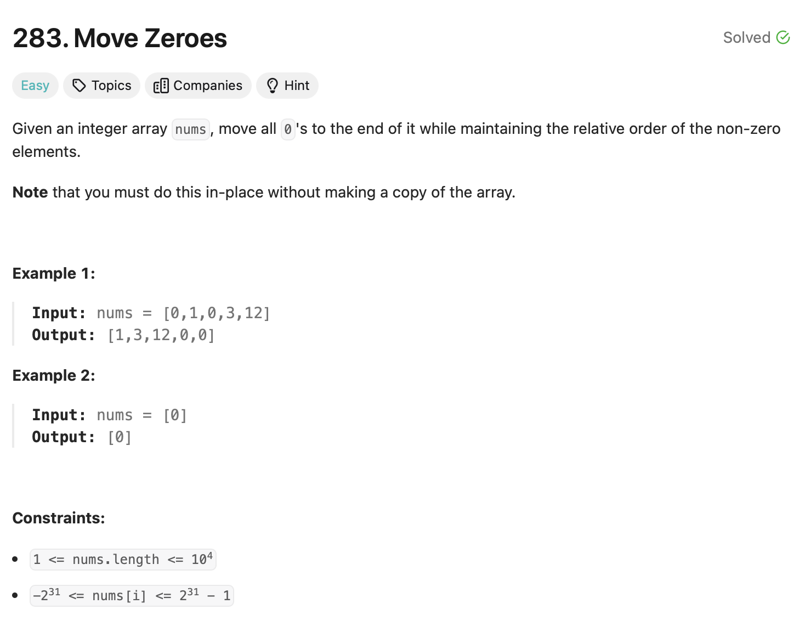

# Move Zeroes 

## Approach
The problem requires moving all zeroes in an array to the end while maintaining the relative order of the non-zero elements. Here's how the approach works:

1. **Initialize Pointers:**
   - Use two pointers `l` and `r`:
     - `l` points to the position where the next non-zero element should be placed.
     - `r` is used to traverse the array.

2. **Iterate Through the Array:**
   - Traverse the array with the pointer `r`:
     - If `nums[l]` is not `0`, increment `l`.
     - If `nums[l] == 0`:
       - Check if `nums[r]` is also `0`. If so, increment `r`.
       - Otherwise, swap `nums[l]` and `nums[r]`, then increment both `l` and `r`.

3. **Ensure All Zeroes Are Moved:**
   - The swapping ensures that all non-zero elements are moved to the front, and the remaining elements are filled with zeroes.

---

## Complexity
### Time Complexity
- **O(n):** 
  - The array is traversed once using the `r` pointer.

### Space Complexity
- **O(1):** 
  - No additional space is used beyond the input array.

---

## Constraints
- `1 <= nums.length <= 10^4`
- `-2^31 <= nums[i] <= 2^31 - 1`
